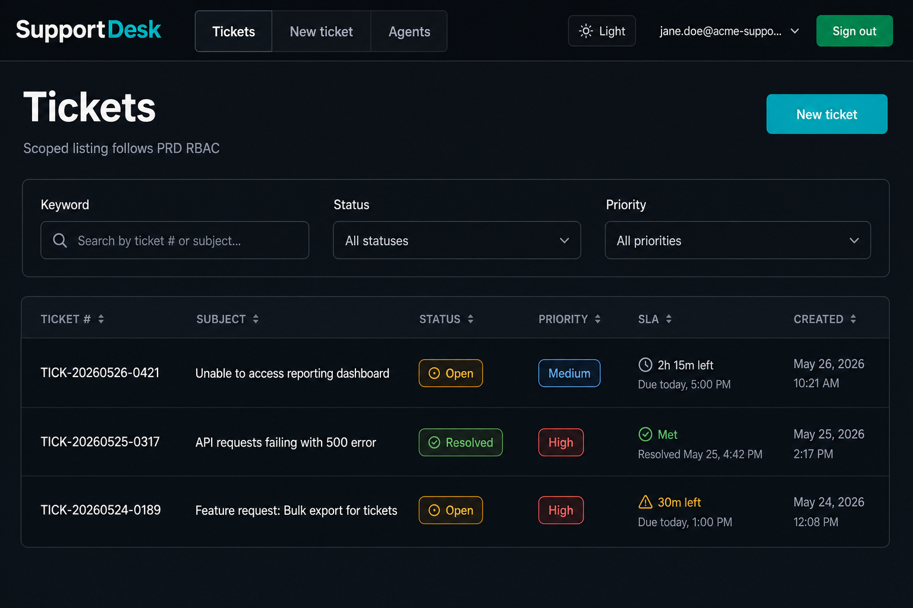

# Customer Support Ticket System (API + Frontend)

Flask REST API implementing **functional requirements FR-001 through FR-016** (ticket creation through comments), plus **priority/SLA metadata (FR-020 / FR-021)**, **RBAC (FR-032 / FR-033)**, and **notification hooks for FR-035** (emails queued in-memory for verification; swap the sink for SMTP/SendGrid in production).

A **[React SPA](frontend/)** in TypeScript consumes the JSON API for day-to-day use (authentication, ticketing, agents roster, optional admin census).

The API follows PRD §6 route shapes, plural resources under `/api/...`, JSON envelopes **`{ "status": "success|error", ... }`** for success payloads (see handlers in `app/http_helpers.py`), and PRD §8 error codes (`VALIDATION_ERROR`, `UNAUTHORIZED`, `FORBIDDEN`, `NOT_FOUND`, `CONFLICT`, `RATE_LIMIT_EXCEEDED`, `INTERNAL_ERROR`).

## Features (summary)

| Area | Behavior |
|------|----------|
| **Tickets** | Create/list/detail/update/delete; ticket numbers `TICK-YYYYMMDD-XXXX` (FR-002); validations per FR-001 + NFR-013/NFR-016 (`app/schemas/api.py`). |
| **Attachments** | Optional on create (`multipart/form-data`): max **3** files, **5 MB** each, extensions `.pdf`, `.jpg`, `.jpeg`, `.png`, `.doc`, `.docx`. |
| **Assignment** | Admin manual assign + optional **auto-assign** (admin-only flag) using workload + expertise + availability (FR-005, FR-006, FR-007, FR-008, FR-009, FR-010). |
| **Status FSM** | Transitions enforced in `app/services/transitions.py`; audit rows in `ticket_status_history` (FR-011–FR-014). |
| **Comments** | Public vs internal (`FR-015`, `FR-016`); customers never receive internal bodies in list/detail serialization. |
| **SLA** | First-response / resolution due times and **approaching** flags on ticket payloads (`app/services/sla.py`; FR-020, FR-021). SLA email hooks via `sla_alerts` + `notifications`. |
| **Security** | Bcrypt (**cost ≥ 12** in prod config), JWT access tokens (**24 h** via `JWT_ACCESS_TOKEN_EXPIRES`), Flask-Limiter **100 req/min** identity (JWT subject when valid, else IP), bleach sanitization (`app/utils/sanitize.py`), SQLAlchemy ORM only. Rate limiter disabled in automated tests and when `DISABLE_RATE_LIMIT=true`. |

## Quick start

```bash
cd 7_3_customer_ticketPRD
python3 -m venv .venv
source .venv/bin/activate  # Windows: .venv\Scripts\activate
pip install -r requirements.txt
cp .env.example .env
# Use strong secrets in .env — JWT_SECRET_KEY should be ≥ 32 characters for HS256 tooling.

export FLASK_APP=app:create_app
flask init-db
flask seed-users
python run.py
```

- **Health**: `GET http://127.0.0.1:5050/healthz`
- **Swagger UI**: `http://127.0.0.1:5050/docs/` (serves `docs/openapi.yaml`)

### Demo accounts (`flask seed-users`)

| Role | Email | Password |
|------|-------|----------|
| Admin | `admin@example.com` | value of `--admin-password` (default `AdminSecure!234`) |
| Agent | `agent@example.com` | `AgentSecure!234` |

Register additional **customers** with `POST /api/auth/register`, then authenticate with `POST /api/auth/login` and send `Authorization: Bearer <token>`.

## Frontend SPA (implementation overview)

The UI lives under **`frontend/`** and mirrors the PRD capability matrix behind the JWT-protected **`/api/...`** contract.

| Layer | Choices |
|------|---------|
| **Stack** | Vite **5**, **React 18**, **TypeScript** (strict), **React Router v6**, **Tailwind CSS** with `darkMode: "class"` and CSS variables (`--surface`, `--ink`, `--accent`, …) for coherent light/dark themes. |
| **Auth & API** | Access token from login/register stored in **`localStorage` / sessionStorage**; `AuthProvider` restores session via `GET /api/auth/me`; all calls go through **`src/lib/api.ts`** (success envelope `status`, `data`, optional `meta`) with unified **`ApiError`** handling for PRD §8 shapes. |
| **Guarding** | `RequireAuth` for ticket routes; **`RequireRole`** gates **Agents** (agent \| admin) and **Users** (admin only); customers never see nav items they cannot use. |
| **Major views** | **Home**, **Login** / **Register**; **`/tickets`** filters + pagination; **`/tickets/new`** JSON body or multipart + attachments (+ admin-only **auto-assign**); **`/tickets/:id`** SLA banners, assign / status / priority (when RBAC permits), threaded comments (+ internal checkbox for staff), audit history; **Agents** roster with self-edit availability/expertise; **Users** list for admins. |



*Illustrative UI capture of the ticketing backlog layout; filters and SLA styling match PRD-aligned fields.*

## Frontend — setup instructions

Use a **Python virtual environment** inside this folder so **`flask-cors`** (and pins in `requirements.txt`) install cleanly—avoid relying on unrelated system Python interpreters.

### 1. Backend (required for the SPA)

```bash
cd 7_3_customer_ticketPRD
python3 -m venv .venv
source .venv/bin/activate   # Windows: .venv\Scripts\activate
pip install -r requirements.txt
cp .env.example .env        # JWT_SECRET_KEY must be ≥32 chars for HS256 tooling
export FLASK_APP=app:create_app
flask init-db               # ⚠ recreate DB schema (run once when bootstrapping)
flask seed-users            # Demo admin / agent credentials
python run.py               # listens on http://127.0.0.1:5050 (see Quick start below)
```

`FLASK_ENV=development` whitelists the Vite dev origin for **`CORS_ORIGINS`** via `config.py` (defaults to `localhost` / `127.0.0.1` on port **5173**). Override with a comma-separated `CORS_ORIGINS` in `.env` if you serve the SPA elsewhere.

### 2. Frontend (Vite dev server)

Requirements: **Node.js 18+**.

```bash
cd 7_3_customer_ticketPRD/frontend
npm install
npm run dev                  # → http://localhost:5173  (proxies /api → :5050)
```

- **Production build**: `npm run build` emits static assets under **`frontend/dist/`**; configure **`VITE_API_BASE`** to the absolute API URL when the SPA and API hosts differ (`frontend/.env.example`), and align **`CORS_ORIGINS`** on Flask.
- **Theme**: Masthead toggle + `support-desk-theme` in **`localStorage`** (see **`frontend/README.md`** for UX notes).

For more SPA-only detail (scripts, capability matrix table), keep **`frontend/README.md`** handy.

## Configuration

Key environment variables (see `.env.example` and `config.py`):

| Variable | Purpose |
|----------|---------|
| `FLASK_ENV` | `development` (default SQLite file under `instance/`), `testing`, or `production`. |
| `SECRET_KEY`, `JWT_SECRET_KEY` | Flask session/signing and JWT signing. |
| `DATABASE_URL` | SQLAlchemy URI (Postgres recommended in production). |
| `DATABASE_URL_OVERRIDE` | Used by tests — do not set in normal development. |
| `CORS_ORIGINS` | Comma-separated origins for browser access to **`/api/*`** (development defaults include Vite `:5173` when unset — see `config.py`). Omit or empty in production to disable CORS unless you explicitly whitelist a UI origin. |
| `DISABLE_RATE_LIMIT` | Set to `true`/`1` to disable the limiter locally. |

**HTTPS (NFR-012)** is expected at the edge (load balancer/reverse proxy) in production — terminate TLS there and enforce redirects there.

## API surface (PRD §6)

- `POST/GET … /api/auth/register|login|logout|me`
- `GET|POST /api/tickets` — filters: `ticket_number`, `email`, `status` (+ comma list), `priority`, `priority_csv`, `category`, `assigned_to`, `q`, `created_after`, `created_before`, `unassigned_only`, `page`, `per_page` (default 20, max 100)
- `GET|PUT|DELETE /api/tickets/:id`
- `POST /api/tickets/:id/assign` — body `{ "assigned_to_user_id"?: number, "auto_assign"?: boolean }` (admin)
- `PUT /api/tickets/:id/status` — body `{ "status", "note"?: string }`
- `PUT /api/tickets/:id/priority` — agents/admins with reason (**FR-024**); audited as internal `[PRIORITY CHANGE] …`
- `GET|POST /api/tickets/:id/comments`
- `GET /api/tickets/:id/history`
- `GET /api/agents`, `PUT /api/agents/:id/availability`
- `GET /api/users` — **admin only**

## Testing & coverage

```bash
cd 7_3_customer_ticketPRD
pytest
```

`pyproject.toml` enables branch coverage with **`fail_under`** set to **73%** (`[tool.coverage.report]`).

The suite (**29** cases in `tests/test_support_api.py`) covers validation, RBAC, status transitions, comments, pagination, attachments, OpenAPI/static docs, and notification kinds.

### Latest documented run (2026-05-26)

The following was recorded locally with:

`python3 -m pytest tests/ -v --cov=app --cov-report=term`

| Metric | Result |
|--------|--------|
| **Outcome** | **29 passed**, 0 failed |
| **Duration** | ~16.2 s (wall clock; varies by machine) |
| **Warnings** | 1 × `UserWarning`: Flask-Limiter uses in-memory storage (expected in dev/tests; configure `storage_uri` in production — see Flask-Limiter docs) |
| **Environment** | macOS (`darwin`), Python **3.14.0**, pytest **9.0.3**, pytest-cov **7.1.0** |

**Coverage (combined line + branch via `pytest-cov`):**

| Coverage metric | Value |
|-----------------|------:|
| Total statements (`TOTAL` row) | 1,050 |
| Branch graph size | 256 branches (`BrPart`: 69) |
| Statements not executed (`Miss`) | 183 |
| **Overall coverage** | **77.5%** (footer: **77.49%**) |
| **`fail_under` gate** | **Passed** (threshold **73%** in `pyproject.toml`) |

Highest-churn uncovered areas at this snapshot: `app/extensions.py` (rate-limit key callable outside full request graphs), parts of `app/routes/tickets.py` (filters, multipart helpers), `app/services/sla_alerts.py`, and agent availability routes. Extend tests there if you need to push toward 80%+ or 90%.


## Project layout

```text
7_3_customer_ticketPRD/
├── frontend/             # React SPA (npm run dev); see frontend/README.md
├── app/
│   ├── models/           # User, Ticket, Comment, Attachment, Assignment, StatusHistory
│   ├── routes/           # auth, tickets, agents, users, errors + JWT/error envelopes
│   ├── services/        # SLA, transitions, notifications, serialization, workflows
│   ├── schemas/api.py    # Marshmallow validation (server-side per NFR)
│   ├── templates/swagger.html
│   └── __init__.py       # factory, SQLite FK pragma, CLI
├── docs/
│   ├── openapi.yaml
│   └── support-desk-screenshot.png  # SPA overview (readme)
├── config.py
├── run.py
├── requirements.txt
├── pyproject.toml
└── tests/
```

## Out of scope / next steps

This milestone focuses on **core ticket management**. Items from the PRD such as dashboards (FR-029+), CSV export (FR-028), saved searches, Talisman CSP hardening everywhere, Redis-backed rate limits, SMTP wiring, @mention resolution to user IDs, and automated SLA escalations can be layered on without changing the public contract documented in `docs/openapi.yaml`.
