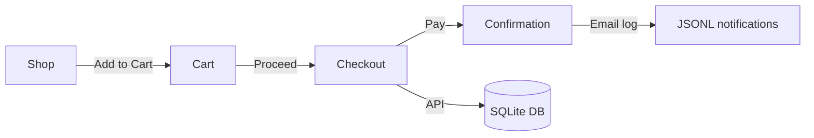
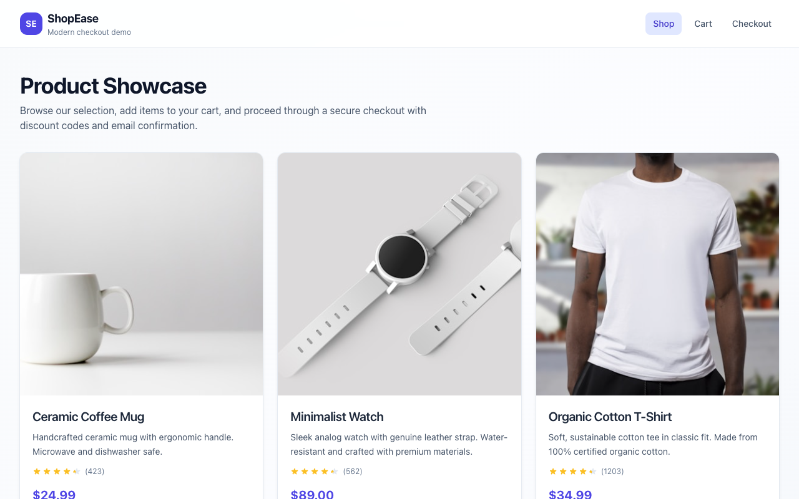
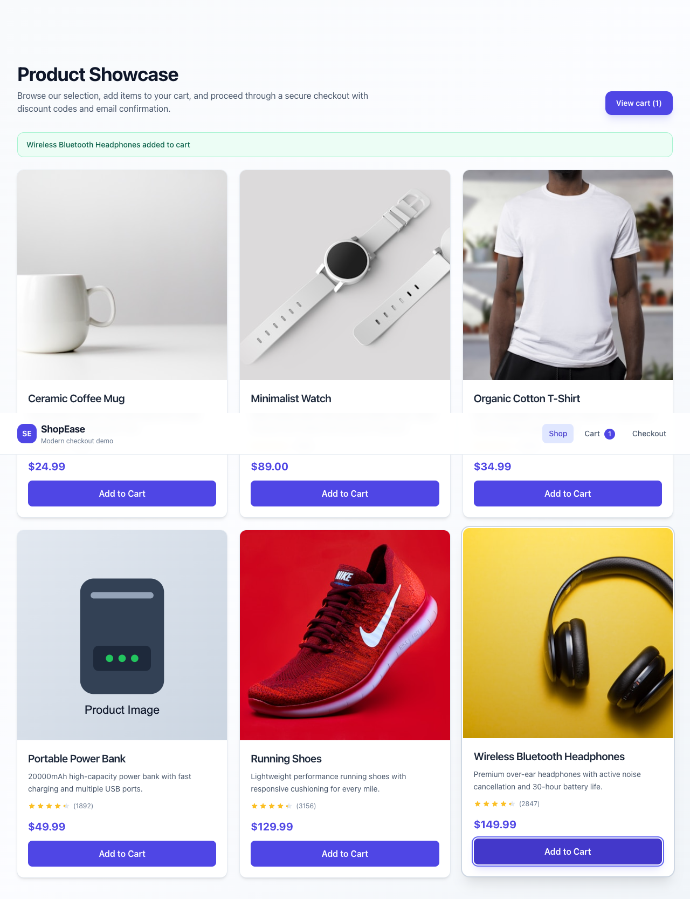
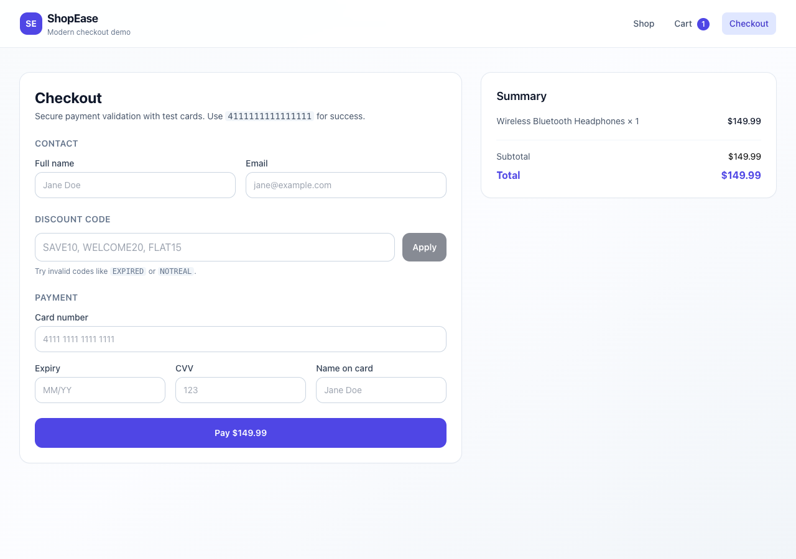
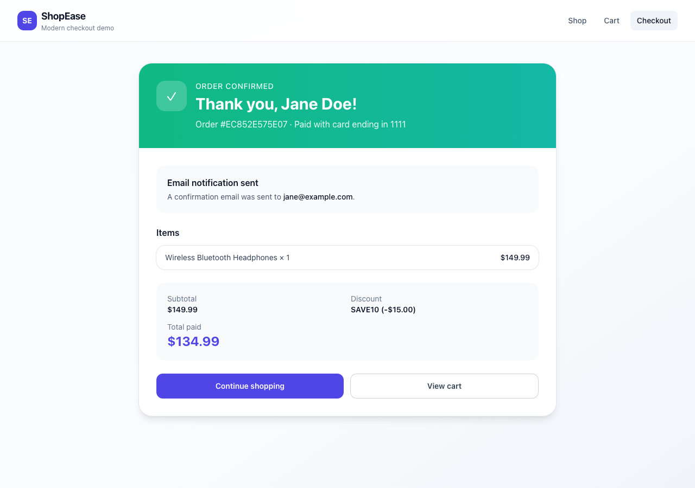

# ShopEase E-Commerce Checkout

A full-stack e-commerce checkout demonstration built for exercise **8_1_ecommerce testing**. ShopEase walks users from product discovery through cart management, discount application, secure payment, order confirmation, and email notification—with comprehensive automated test coverage across positive, negative, edge, and security scenarios.

---

## Application Overview

ShopEase is a modern checkout flow composed of a **React + Tailwind CSS** frontend and a **Flask + SQLite** backend. Users browse a product catalog (reusing the **exercise1 `ProductCard`** component), add items to a client-side cart, apply promotional codes, submit payment details, and receive an order confirmation with a logged email notification.

### User flow



| Stage | What happens |
|-------|----------------|
| **Shop** | Products loaded from `GET /api/products`; clicking **Add to Cart** updates React cart state |
| **Cart** | Adjust quantities, remove items, review subtotal; empty cart blocks checkout |
| **Checkout** | Contact info, discount codes, payment form; backend validates and processes order |
| **Confirmation** | Order summary, masked card (`last4`), email notification status |
| **Email** | Mock service appends JSON lines to `backend/logs/email_notifications.jsonl` |

### Tech stack

| Layer | Technologies |
|-------|--------------|
| Frontend | React 18, TypeScript, Vite, Tailwind CSS, React Router |
| Backend | Flask, Flask-CORS, SQLite (parameterized queries) |
| Testing | pytest (API/integration), Vitest (cart state) |
| Reused UI | `CursorAI1/exercise1/exercise1/src/components/ProductCard.tsx` |

### Key capabilities

- **Cart** — add, increment, update quantity, remove, clear; responsive layout
- **Discounts** — `SAVE10`, `WELCOME20`, `FLAT15`, `VIP50` (single-use); expired/invalid handling
- **Payment** — Luhn validation, expiry/CVV checks, declined test cards; only last 4 digits stored
- **Security** — SQL injection filtering, input sanitization, parameterized DB queries
- **Orders** — persisted with line items; retrievable via `GET /api/orders/:orderId`

---

## Project Structure

```
8_1_ecommerce testing/
├── README.md                          # This file
├── docs/
│   ├── capture-screenshots.mjs        # Playwright script to regenerate screenshots
│   └── screenshots/                   # Application screenshots (see below)
├── backend/
│   ├── app/
│   │   ├── __init__.py                # Flask app factory
│   │   ├── db.py                      # SQLite schema + seed data
│   │   ├── routes/
│   │   │   ├── products.py            # GET /api/products
│   │   │   ├── discounts.py           # POST /api/discounts/validate
│   │   │   ├── checkout.py            # POST /api/checkout
│   │   │   └── orders.py              # GET /api/orders/:id
│   │   ├── services/
│   │   │   ├── orders.py              # Checkout orchestration
│   │   │   ├── discounts.py           # Discount lookup + calculation
│   │   │   ├── payment.py             # Mock payment processor
│   │   │   └── email_service.py       # Email notification logger
│   │   └── utils/
│   │       └── security.py            # Validation, Luhn, SQLi detection
│   ├── tests/
│   │   ├── TEST_CASES.md              # Full test case catalog (45+ cases)
│   │   ├── conftest.py                # Fixtures + test DB isolation
│   │   ├── helpers/test_data.py       # Test data factories
│   │   ├── test_positive.py
│   │   ├── test_negative.py
│   │   ├── test_edge_cases.py
│   │   ├── test_security.py
│   │   └── test_unit.py
│   ├── logs/                          # Email notification JSONL (runtime)
│   ├── requirements.txt
│   └── run.py                         # Entry point (port 5051)
└── frontend/
    ├── src/
    │   ├── components/
    │   │   ├── ProductCard.tsx        # Reused from exercise1
    │   │   ├── RatingStars.tsx
    │   │   └── Layout.tsx
    │   ├── context/
    │   │   ├── CartContext.tsx        # Cart + discount state
    │   │   └── CartContext.test.tsx   # Vitest cart tests
    │   ├── pages/
    │   │   ├── ShopPage.tsx
    │   │   ├── CartPage.tsx
    │   │   ├── CheckoutPage.tsx
    │   │   └── ConfirmationPage.tsx
    │   ├── lib/api.ts                 # API client
    │   └── types/product.ts
    ├── package.json
    └── vite.config.ts                 # Dev server port 5174, API proxy
```

### API endpoints

| Method | Path | Description |
|--------|------|-------------|
| `GET` | `/api/products` | List catalog products |
| `POST` | `/api/discounts/validate` | Validate discount code against subtotal |
| `POST` | `/api/checkout` | Process payment and create order |
| `GET` | `/api/orders/:orderId` | Fetch order confirmation details |

---

## Setup Instructions

### Prerequisites

- **Python 3.10+**
- **Node.js 18+** and npm

### 1. Backend (port 5051)

```bash
cd "8_1_ecommerce testing/backend"
python3 -m venv .venv
source .venv/bin/activate          # Windows: .venv\Scripts\activate
pip install -r requirements.txt
python run.py
```

The API runs at **http://127.0.0.1:5051**. On first start, SQLite creates `ecommerce.db` and seeds products + discount codes.

### 2. Frontend (port 5174)

In a second terminal:

```bash
cd "8_1_ecommerce testing/frontend"
npm install
npm run dev
```

Open **http://localhost:5174**. Vite proxies `/api` requests to the backend.

### 3. Manual smoke test

1. Add a product from the shop page.
2. Open **Cart** → **Proceed to checkout**.
3. Apply discount code `SAVE10`.
4. Pay with card `4111111111111111`, expiry `12/30`, CVV `123`.
5. Confirm the order page appears and check `backend/logs/email_notifications.jsonl`.

### Test cards

| Card number | Result |
|-------------|--------|
| `4111111111111111` | Success |
| `378282246310005` | Success (Amex, 4-digit CVV) |
| `4111111111111112` | Invalid (Luhn failure) |
| `4000000000000002` | Declined by issuer |

---

## Screenshots

Screenshots captured from the running application (May 27, 2026).

### Shop — product catalog with Add to Cart



### Cart — item added with quantity and order summary



### Checkout — contact, discount, and payment form



### Order confirmation — success state and email notification



To regenerate screenshots (requires backend + frontend running):

```bash
cd "8_1_ecommerce testing"
node docs/capture-screenshots.mjs
```

---

## Testing

Automated tests cover the full checkout pipeline: cart operations, discount validation, payment processing, order persistence, email logging, and security controls. A detailed manual catalog lives in [`backend/tests/TEST_CASES.md`](backend/tests/TEST_CASES.md).

### Test data strategy

| Component | Location | Purpose |
|-----------|----------|---------|
| Catalog constants | `tests/helpers/test_data.py` | Product IDs, discount codes, test cards |
| Payload factories | `build_checkout_payload()`, `build_cart_items()` | Compose requests without duplication |
| Isolation | `conftest.py` temp SQLite DB | Fresh database per test run |
| Attack strings | `SQL_INJECTION_PAYLOADS` | Security regression inputs |

### How to run tests

**Backend (pytest):**

```bash
cd "8_1_ecommerce testing/backend"
source .venv/bin/activate
pytest -v                         # all backend tests
pytest -m positive                # positive category only
pytest -m negative                # negative category only
pytest -m edge                    # edge cases only
pytest -m security                # security category only
pytest -m unit                    # unit tests only
pytest --cov=app --cov-report=term-missing
```

**Frontend (Vitest):**

```bash
cd "8_1_ecommerce testing/frontend"
npm test
```

### QA automation suite

The [`qa-automation/`](qa-automation/) directory provides a full quality pipeline: Playwright E2E (Page Object Model), ESLint/Pylint, OWASP ZAP + Snyk, k6 load tests, and an HTML metrics dashboard.

```bash
cd qa-automation
npm install && npx playwright install chromium
python3 -m venv .venv && source .venv/bin/activate && pip install -r requirements-qa.txt
./scripts/run-all-qa.sh
```

See [**qa-automation/README.md**](qa-automation/README.md) for quality gates, CI integration, and script options.

---

## Test Results by Category

**Last run:** May 27, 2026 — **73/73 passing** (66 backend + 7 frontend)

### Positive scenarios — successful checkout flow

**Result: 12/12 passed** · `pytest -m positive`

| ID | Test | Status |
|----|------|--------|
| TC-P01 | List products returns catalog | ✅ Pass |
| TC-P02 | Single-item checkout success | ✅ Pass |
| TC-P03 | Multi-item checkout success | ✅ Pass |
| TC-P04 | Checkout with SAVE10 / WELCOME20 / FLAT15 | ✅ Pass (×3) |
| TC-P05 | Discount validation returns amount | ✅ Pass |
| TC-P06 | Order confirmation retrievable by ID | ✅ Pass |
| TC-P07 | Email notification logged on success | ✅ Pass |
| TC-P08 | Email contains order summary | ✅ Pass |
| TC-P09 | Payment stores only last four digits | ✅ Pass |
| TC-P10 | Checkout without discount code | ✅ Pass |

**Covers:** product listing, single/multi-item orders, all active discount codes, order lookup, email notifications, PCI-style last4 storage.

---

### Negative scenarios — failures and validation errors

**Result: 16/16 passed** · `pytest -m negative`

| ID | Test | Status |
|----|------|--------|
| TC-N01 | Empty cart rejected | ✅ Pass |
| TC-N02 | Invalid discount code rejected | ✅ Pass |
| TC-N03 | Expired discount code rejected | ✅ Pass |
| TC-N04 | Discount below minimum order | ✅ Pass |
| TC-N05 | Invalid Luhn card rejected | ✅ Pass |
| TC-N06 | Declined card rejected | ✅ Pass |
| TC-N07 | Invalid CVV rejected (2-digit, 5-digit) | ✅ Pass (×2) |
| TC-N08 | Expired card rejected | ✅ Pass |
| TC-N09 | Invalid expiry format rejected | ✅ Pass |
| TC-N10 | Invalid email rejected | ✅ Pass |
| TC-N11 | Unknown product rejected | ✅ Pass |
| TC-N12 | Zero quantity rejected | ✅ Pass |
| TC-N13 | Order not found returns 404 | ✅ Pass |
| TC-N14 | Empty discount code rejected | ✅ Pass |
| TC-N15 | Short card number rejected | ✅ Pass |

**Covers:** empty cart, invalid/expired codes, payment failures, bad input validation, missing resources.

---

### Edge cases — boundaries and concurrency

**Result: 8/8 passed** · `pytest -m edge`

| ID | Test | Status |
|----|------|--------|
| TC-E01 | Large cart quantity (50 items) | ✅ Pass |
| TC-E02 | Multiple distinct products in one order | ✅ Pass |
| TC-E03 | Sequential concurrent purchases (unique order IDs) | ✅ Pass |
| TC-E04 | VIP50 single-use limit enforced | ✅ Pass |
| TC-E05 | Fixed discount capped at subtotal | ✅ Pass |
| TC-E06 | Negative quantity rejected | ✅ Pass |
| TC-E07 | Spaced card number accepted (Luhn after strip) | ✅ Pass |
| TC-E08 | Amex 4-digit CVV accepted | ✅ Pass |

**Covers:** cart limits, multi-SKU orders, concurrent order creation, single-use coupons, payment format edge cases.

---

### Security scenarios — PCI-style validation and injection prevention

**Result: 13/13 passed** · `pytest -m security`

| ID | Test | Status |
|----|------|--------|
| TC-S01 | SQL injection in discount code blocked | ✅ Pass (×2 payloads) |
| TC-S02 | SQL injection in customer name blocked | ✅ Pass |
| TC-S03 | SQL injection in email blocked | ✅ Pass |
| TC-S04 | UNION injection in cardholder name blocked | ✅ Pass |
| TC-S05 | Database intact after injection attempts | ✅ Pass |
| TC-S06 | Oversized customer name rejected | ✅ Pass |
| TC-S07 | SQL payload in card number rejected | ✅ Pass |
| TC-S08 | Full PAN not in order response | ✅ Pass |
| TC-S09 | Full PAN not in email log | ✅ Pass |
| TC-S10 | Parameterized order lookup (no injection leak) | ✅ Pass |
| TC-S11 | Only last4 persisted on successful order | ✅ Pass |
| TC-S12 | Malicious product ID rejected safely | ✅ Pass |

**Covers:** SQL injection prevention, input length limits, PCI compliance (no full card storage in API or logs), parameterized queries.

---

### Unit tests — payment and security utilities

**Result: 17/17 passed** · `pytest -m unit`

| Area | Tests | Status |
|------|-------|--------|
| SQL injection detection | 4 parametrized strings | ✅ Pass |
| Luhn validation | 3 card numbers | ✅ Pass |
| Card number stripping | Non-digit removal | ✅ Pass |
| CVV validation | 3- and 4-digit + invalid length | ✅ Pass |
| Expiry validation | Future accepted, past rejected | ✅ Pass |
| Email normalization | Lowercase + format | ✅ Pass |
| Sanitize text | Injection rejection | ✅ Pass |
| Payment service | Success, zero amount, declined card | ✅ Pass |

**Covers:** isolated validation logic for payment fields and security helpers.

---

### Frontend — cart state (Vitest)

**Result: 7/7 passed** · `npm test`

| ID | Test | Status |
|----|------|--------|
| TC-F01 | Adds item to cart | ✅ Pass |
| TC-F02 | Increments quantity for same product | ✅ Pass |
| TC-F03 | Updates quantity and subtotal | ✅ Pass |
| TC-F04 | Removes item from cart | ✅ Pass |
| TC-F05 | Clears cart and discount | ✅ Pass |
| TC-F06 | Zero subtotal for empty cart | ✅ Pass |
| TC-F07 | Multiple products in cart | ✅ Pass |

**Covers:** client-side cart state management that drives the checkout UI.

---

## Summary

| Category | Tests | Result |
|----------|------:|--------|
| Positive | 12 | ✅ 12/12 |
| Negative | 16 | ✅ 16/16 |
| Edge | 8 | ✅ 8/8 |
| Security | 13 | ✅ 13/13 |
| Unit | 17 | ✅ 17/17 |
| Frontend (Vitest) | 7 | ✅ 7/7 |
| **Total** | **73** | **✅ 73/73** |

All critical checkout paths are covered: cart → discount → payment → order → email, with explicit negative, edge, and security regression tests. See [`backend/tests/TEST_CASES.md`](backend/tests/TEST_CASES.md) for the complete 45+ case catalog with steps and expected outcomes.
