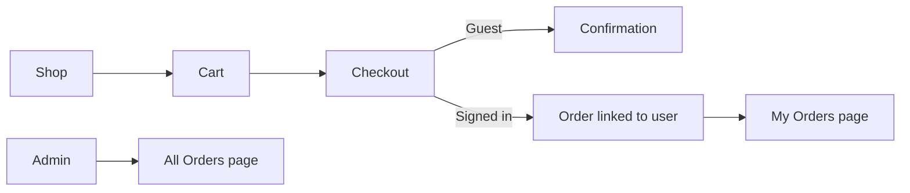

# ShopEase E-Commerce — API Test Suite (8_2_API_test)

Full-stack e-commerce application built from **8_1_ecommerce testing**, extended with JWT authentication, user management, product/order REST CRUD, **role-based order viewing**, rate limiting, and a comprehensive API test suite.

---

## Application Overview

ShopEase combines a **React + Tailwind** frontend with a **Flask + SQLite** REST API. Users can browse products (guest), sign in, manage carts, checkout with payment, and view orders on the **Orders** page. Admins see all orders; customers see only their own.

### User flow



| Stage | What happens |
|-------|----------------|
| **Shop / Cart** | Browse catalog, manage cart (guest or signed in) |
| **Checkout** | Pay with card; optional JWT links `user_id` to the order |
| **Confirmation** | Order summary; guests can open confirmation URL without login |
| **Orders** (`/orders`) | **Customers:** `GET /api/orders` returns only their orders. **Admins:** all orders with customer name/email |
| **Order detail** | Expandable cards; link to full confirmation view |

### Tech stack

| Layer | Technologies |
|-------|--------------|
| Frontend | React 18, TypeScript, Vite, Tailwind CSS, React Router |
| Backend | Flask, Flask-CORS, PyJWT, SQLite |
| Testing | pytest (API/integration), Vitest (cart state) |

### API endpoints

| Method | Path | Auth | Description |
|--------|------|------|-------------|
| `POST` | `/api/auth/register` | — | Register customer account |
| `POST` | `/api/auth/login` | — | Login, returns JWT |
| `GET` | `/api/auth/me` | Bearer | Current user profile |
| `GET` | `/api/users` | Admin | List users |
| `POST` | `/api/users` | Admin | Create user |
| `GET` | `/api/users/:id` | Self/Admin | Get user |
| `PUT` | `/api/users/:id` | Self/Admin | Update user |
| `DELETE` | `/api/users/:id` | Admin | Delete user |
| `GET` | `/api/products` | — | List products |
| `GET` | `/api/products/:id` | — | Get product |
| `POST` | `/api/products` | Admin | Create product |
| `PUT` | `/api/products/:id` | Admin | Update product |
| `DELETE` | `/api/products/:id` | Admin | Delete product |
| `GET` | `/api/orders` | Bearer | **Customer:** own orders only · **Admin:** all orders |
| `POST` | `/api/orders` | Bearer | Create pending order (CRUD) |
| `GET` | `/api/orders/:id` | Bearer* | Get order (*Bearer required when `user_id` is set) |
| `PUT` | `/api/orders/:id` | Bearer | Update order (status: admin; contact: owner) |
| `DELETE` | `/api/orders/:id` | Admin | Delete order |
| `POST` | `/api/checkout` | Optional Bearer | Payment checkout; Bearer links `user_id` |
| `POST` | `/api/discounts/validate` | — | Validate discount code |

**Order visibility rules**

| Viewer | `GET /api/orders` | `GET /api/orders/:id` |
|--------|-------------------|------------------------|
| Guest | 401 | 200 if `user_id` is null (guest checkout); else 401 |
| Customer | Own orders only | Own orders; 403 for others |
| Admin | All orders | Any order |

**Seeded accounts**

| Email | Password | Role |
|-------|----------|------|
| `admin@shopease.com` | `admin12345` | admin |
| `customer@shopease.com` | `customer12345` | customer |

---

## Project Structure

```
8_2_API_test/
├── README.md
├── backend/
│   ├── app/
│   │   ├── auth.py
│   │   ├── middleware/rate_limit.py
│   │   ├── routes/                 # auth, users, products, orders, checkout
│   │   └── services/
│   └── tests/
│       ├── test_api_auth.py
│       ├── test_api_authorization.py
│       ├── test_api_crud.py
│       ├── test_api_orders.py        # My Orders / All Orders API behavior
│       ├── test_api_validation.py
│       ├── test_api_errors.py
│       ├── test_api_performance.py
│       ├── test_api_rate_limiting.py
│       └── (8_1 checkout tests retained)
└── frontend/
    ├── src/pages/OrdersPage.tsx      # Role-based order list UI
    ├── src/components/OrderCard.tsx
    └── src/components/ProtectedRoute.tsx
```

---

## Setup

### Backend (port 5052)

```bash
cd 8_2_API_test/backend
python3 -m venv .venv
source .venv/bin/activate
pip install -r requirements.txt
python run.py
```

### Frontend (port 5175)

```bash
cd 8_2_API_test/frontend
npm install
npm run dev
```

Open **http://localhost:5175**. Sign in, then open **Orders** in the nav (or http://localhost:5175/orders).

**Try it**

1. Sign in as `customer@shopease.com` → place checkout or `POST /api/orders` → **Orders** shows only your orders.
2. Sign in as `admin@shopease.com` → **Orders** shows every customer’s orders with name and email.

---

## Running Tests

### API test categories

```bash
cd 8_2_API_test/backend
source .venv/bin/activate

pytest -v                           # all tests
pytest -m orders                    # order list/detail + checkout ownership
pytest -m auth                      # authentication
pytest -m authorization             # role-based access
pytest -m crud                      # GET/POST/PUT/DELETE
pytest -m validation                # input validation
pytest -m errors                    # 404, 400, 500
pytest -m performance               # response time < 500ms
pytest -m rate_limit                # rate limiting (429)
```

### Full suite with coverage

```bash
pytest --cov=app --cov-report=term-missing
```

### Frontend (Vitest)

```bash
cd 8_2_API_test/frontend
npm test
```

---

## Test Results Summary

**Last run:** May 27, 2026 — **139/139 passing**

| Category | Tests | Marker | Result |
|----------|------:|--------|--------|
| Authentication | 10 | `auth` | ✅ |
| Authorization | 11 | `authorization` | ✅ |
| CRUD | 14 | `crud` | ✅ |
| **Orders (list/detail)** | **15** | **`orders`** | **✅** |
| Input validation | 8 | `validation` | ✅ |
| Error handling | 7 | `errors` | ✅ |
| Performance | 6 | `performance` | ✅ |
| Rate limiting | 2 | `rate_limit` | ✅ |
| Checkout (8_1) | 66 | `positive`, `negative`, … | ✅ |
| **Total** | **139** | | **✅** |

See [`backend/tests/TEST_CASES.md`](backend/tests/TEST_CASES.md) for the full API test catalog.

---

## Rate Limiting

Default: **100 requests per 60 seconds** per client IP. Exceeded requests return **429** with `retry_after_seconds`. Disabled in the default test fixture; enabled in `rate_limited_app` for rate-limit tests.

---

## Performance Tests

Performance tests assert each sampled endpoint responds in **under 500ms** using `time.perf_counter()` against the in-memory Flask test client (no network latency).
