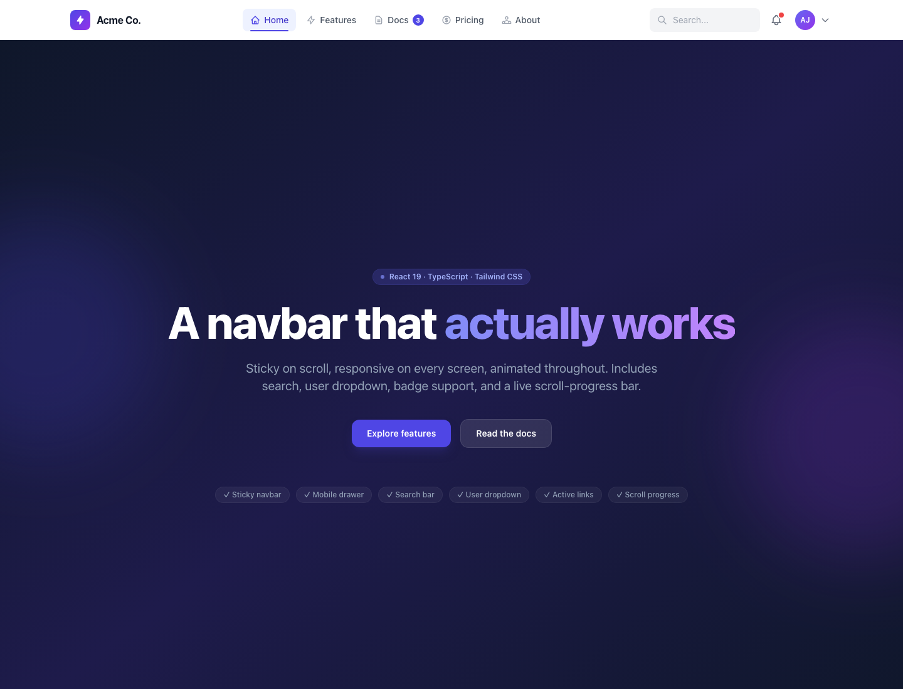

# Exercise 2 — Responsive navigation bar

A Create React App demo built around a reusable **Navbar**: logo, primary navigation, **search**, **user profile dropdown**, optional notification affordance, and a **mobile hamburger** menu with a slide-in drawer. Configuration and props are expressed in **TypeScript**; layout, responsiveness, sticky behavior, and motion use **Tailwind CSS** transitions.

## Purpose

- **Navbar** (`src/components/Navbar.tsx`) — Fixed (sticky) header with frosted-glass and shadow when the user scrolls past a small threshold; smooth scroll to in-page sections; animated scroll **progress** bar along the bottom of the bar.
- **Desktop** — Inline nav links with icons and optional badges, expanding **search** field (`role="search"`), notifications control, and **UserDropdown**.
- **Mobile / tablet** — **Hamburger** control (`aria-expanded`, morphing icon) opens **MobileMenu** with nav, search, and account area; closes on breakpoint change to large screens.
- **TypeScript** — Shared types for nav items, user profile, and navbar props in `src/types/navigation.ts`.
- **Tailwind CSS** — Utility classes for breakpoints (`md`, `lg`), hover/focus rings, backdrop blur, and transition durations.

The demo page **`NavbarDemo`** (`src/pages/NavbarDemo.tsx`) wires sample nav data, a user profile, and long-form content so you can exercise scroll, hash links, and responsive layouts.

## Requirements

- **Node.js** 18+ (LTS recommended) and **npm**.

## Setup

1. From this directory (the Create React App root):

   ```bash
   npm install --legacy-peer-deps
   ```

   `react-scripts@5` optional peers expect TypeScript 3–4; this project uses TypeScript 5, so `--legacy-peer-deps` avoids a peer resolution error at install time.

2. Start the development server:

   ```bash
   npm start
   ```

   Open [http://localhost:3000](http://localhost:3000). `App` renders `NavbarDemo` by default.

3. Optional — do not open a browser from the CLI:

   ```bash
   BROWSER=none npm start
   ```

4. Other scripts:

   | Command         | Description                   |
   | --------------- | ----------------------------- |
   | `npm test`      | Jest / React Testing Library  |
   | `npm run build` | Production build to `build/` |

### Troubleshooting

- **`EMFILE: too many open files`** — Raise the limit in the same shell (e.g. `ulimit -n 10240`) before `npm start`, or see [CRA troubleshooting](https://facebook.github.io/create-react-app/docs/troubleshooting).

### Lint notes

`npm start` may report ESLint warnings (e.g. `jsx-a11y/anchor-is-valid` on the logo `#` link, or `no-useless-escape` in demo copy). They do not block the dev build; fix in place when tightening a11y or strings.

## Project structure

```text
.                             ← Create React App root (this folder)
├── docs/
│   └── demo-screenshot.png   ← screenshot of the Navbar demo
├── public/
├── src/
│   ├── components/
│   │   ├── Navbar.tsx        # Sticky header, search, hamburger, desktop nav
│   │   ├── MobileMenu.tsx    # Mobile drawer + nav + search
│   │   ├── UserDropdown.tsx  # Profile menu
│   │   ├── ProductCard.tsx   # (shared from other exercises)
│   │   ├── RatingStars.tsx
│   │   └── TaskList.tsx
│   ├── pages/
│   │   ├── NavbarDemo.tsx    # Demo page for the navbar
│   │   └── ProductDemo.tsx
│   ├── types/
│   │   ├── navigation.ts     # NavItem, NavbarProps, UserProfile, …
│   │   └── product.ts
│   ├── App.js                # Entry → NavbarDemo
│   ├── index.js
│   └── index.css             # Tailwind directives
├── package.json
├── tailwind.config.js
├── postcss.config.js
└── tsconfig.json
```

One level up, the **exercise 2** folder includes a short README that links here.

## Demo screenshot

Navbar demo at `http://localhost:3000`:



---

This project was bootstrapped with [Create React App](https://github.com/facebook/create-react-app). More CRA topics live in the [CRA documentation](https://facebook.github.io/create-react-app/docs/getting-started).
