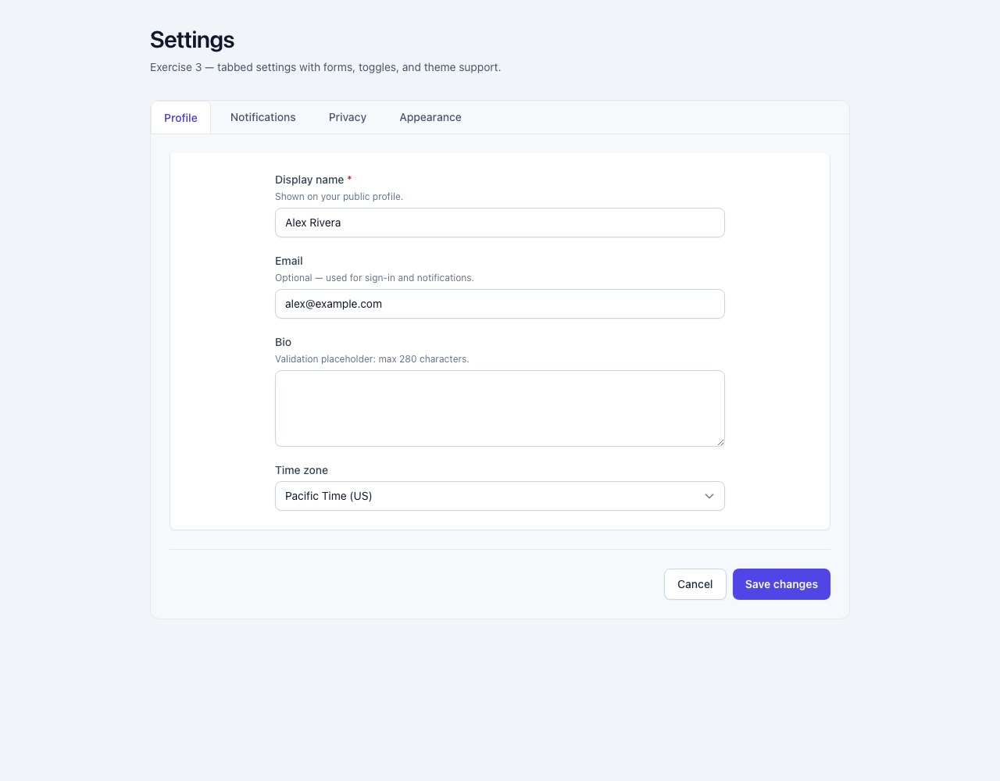

# Exercise 3 — Settings panel

A Create React App demo built around a **`SettingsPanel`** component: **tabs** for **Profile**, **Notifications**, **Privacy**, and **Appearance**, with **form inputs**, **toggle switches**, **dropdowns** (`SelectField`), and **Save / Cancel** actions. Styling uses **Tailwind CSS** with **`darkMode: 'class'`** so light, dark, and **system** themes apply across the UI. The layout is responsive; tabs, toggles, and panels follow accessible patterns (tab list, `role="switch"`, labels, live status region, focus rings).

## Purpose

- **Tabs** — `SettingsTabs` implements `role="tablist"` / `role="tab"` / `role="tabpanel"`, arrow/Home/End keyboard navigation, and visible focus styles.
- **Profile** — Text fields, textarea (with length validation), and time zone select.
- **Notifications** — Email digest, push, and marketing **toggles** plus digest frequency **dropdown**.
- **Privacy** — Profile visibility **dropdown** and discoverability / usage **toggles**.
- **Appearance** — Theme (**system** / light / dark), density **dropdown**, and reduced-motion **toggle**; theme updates `document.documentElement` (`dark` class) and listens for system preference changes when theme is **system**.
- **Actions** — **Save changes** validates profile (required name, email shape, bio length), updates saved state, and Announces status via `role="status"` / `aria-live="polite"`. **Cancel** restores the last saved snapshot.

The **`SettingsDemo`** page (`src/pages/SettingsDemo.tsx`) wraps the panel with page chrome and documents the exercise.

End-to-end checks live under **`e2e/`** (Playwright); see `package.json` scripts.

## Requirements

- **Node.js** 18+ (LTS recommended) and **npm**.

## Setup

1. From this directory (the Create React App root):

   ```bash
   npm install --legacy-peer-deps
   ```

   `react-scripts@5` optional peers target TypeScript 4.x; this project uses TypeScript 5, so `--legacy-peer-deps` avoids install peer conflicts.

2. Start the app:

   ```bash
   npm start
   ```

   Open [http://localhost:3000](http://localhost:3000). `App` renders `SettingsDemo`.

3. Optional — do not open a browser from the CLI:

   ```bash
   BROWSER=none npm start
   ```

4. **Playwright** (first time only, if you run E2E tests):

   ```bash
   npm run test:e2e:install
   ```

5. Scripts:

   | Command | Description |
   | ------- | ----------- |
   | `npm start` | Development server |
   | `npm test` | Jest / RTL unit tests |
   | `npm run build` | Production build → `build/` |
   | `npm run test:e2e` | Playwright tests |
   | `npm run test:e2e:headed` | Playwright with browser UI |
   | `npm run test:e2e:report` | Open last HTML report |

### Troubleshooting

- **`EMFILE: too many open files`** — Increase the shell limit (e.g. `ulimit -n 10240`) before `npm start`, or see [CRA troubleshooting](https://facebook.github.io/create-react-app/docs/troubleshooting).

## Project structure

```text
.                             ← Create React App root (this folder)
├── docs/
│   └── demo-screenshot.png   ← screenshot of the Settings demo (Profile tab)
├── e2e/
│   ├── settings-panel.spec.ts
│   └── TEST-REPORT.md
├── public/
├── src/
│   ├── exercise3/
│   │   ├── SettingsPanel.tsx   # Tab panels, state, save/cancel, theme
│   │   ├── SettingsTabs.tsx    # Accessible tab bar
│   │   ├── ToggleSwitch.tsx    # role="switch" toggle
│   │   └── form/               # TextField, TextAreaField, SelectField
│   ├── pages/
│   │   └── SettingsDemo.tsx    # Demo page shell
│   ├── App.js
│   ├── index.js
│   └── index.css               # Tailwind directives
├── playwright.config.ts
├── package.json
├── tailwind.config.js          # darkMode: 'class'
├── postcss.config.js
└── tsconfig.json
```

One level up, the **exercise 3** folder has a short README that links here.

## Demo screenshot

Settings page at `http://localhost:3000` (Profile tab, default light appearance):



Switch **Appearance → Theme** to **Dark** in the app to see full dark-mode styling.

---

This project was bootstrapped with [Create React App](https://github.com/facebook/create-react-app). More CRA topics: [CRA documentation](https://facebook.github.io/create-react-app/docs/getting-started).
