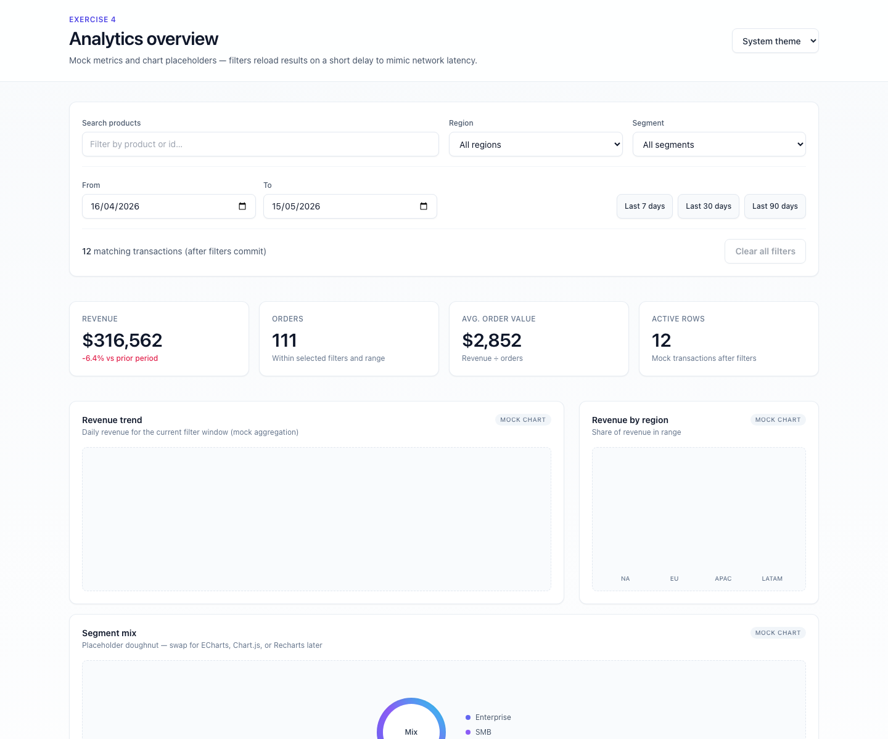

# Exercise 4 — Analytics dashboard

A Create React App demo for a **data analytics dashboard**: **KPI cards**, **chart placeholders** with simple CSS “trend” visualizations, a **sortable, paginated data table**, and a **filter toolbar** (search, region, segment, **date range**, quick presets, clear-all). The UI uses **Tailwind CSS** with a neutral + indigo palette, gradients, and glassy header—suited to a **modern, professional** look. **Dark mode** is supported via Tailwind’s **`darkMode: 'class'`** and a **system / light / dark** theme control.

## Purpose

- **`AnalyticsDashboard`** — Orchestrates mock data (`mockData.ts`), filter state with a short “loading” delay after changes, KPI computation, charts built from filtered rows, and the transactions table.
- **KPIs** — `KpiCard` grid for revenue (with delta vs prior window), orders, average order value, and active row count; skeleton/shimmer while “loading”.
- **Charts** — `ChartPlaceholder` cards wrapping **DailyTrend** (mini bar/spark area style), **RegionBars**, and a **donut** placeholder for future chart libraries.
- **Filters** — `FilterToolbar`: product/id **search**, **region** and **segment** dropdowns, **from/to date** inputs, **Last 7 / 30 / 90 days** presets, matching count with `aria-live`, and **Clear all filters**.
- **Table** — `DataTable` with column definitions, sort selector, pagination, and empty/loading states.

The **theme** helper (`theme.ts`) toggles the `dark` class on `document.documentElement` for system/light/dark, mirroring common product patterns.

**`AnalyticsDemo`** (`src/pages/AnalyticsDemo.tsx`) renders the dashboard by default. Append **`?analyticsError=1`** to the URL to simulate an outage screen (useful for E2E error tests).

Playwright specs live under **`e2e/`**.

## Requirements

- **Node.js** 18+ (LTS recommended) and **npm**.

## Setup

1. From this directory (the Create React App root):

   ```bash
   npm install --legacy-peer-deps
   ```

   `react-scripts@5` optional peer types expect TypeScript 4.x; this project uses TypeScript 5, so `--legacy-peer-deps` avoids install peer conflicts.

2. Start the app:

   ```bash
   npm start
   ```

   Open [http://localhost:3000](http://localhost:3000). `App` loads `AnalyticsDemo` → `AnalyticsDashboard`.

3. Optional:

   ```bash
   BROWSER=none npm start
   ```

4. **Playwright** (first-time browser install for E2E):

   ```bash
   npm run test:e2e:install
   ```

5. Scripts:

   | Command | Description |
   | ------- | ----------- |
   | `npm start` | Development server |
   | `npm test` | Jest / RTL |
   | `npm run build` | Production build → `build/` |
   | `npm run test:e2e` | Playwright tests |
   | `npm run test:e2e:headed` | Playwright with UI |
   | `npm run test:e2e:report` | Open HTML report |

### Troubleshooting

- **`EMFILE: too many open files`** — Raise `ulimit -n` in the same shell before `npm start`, or see [CRA troubleshooting](https://facebook.github.io/create-react-app/docs/troubleshooting).

## Project structure

```text
.                             ← Create React App root (this folder)
├── docs/
│   └── demo-screenshot.png   ← dashboard demo (default theme)
├── e2e/
│   ├── pages/
│   ├── tests/
│   └── TEST-REPORT.md
├── public/
├── src/
│   ├── exercise4/
│   │   ├── AnalyticsDashboard.tsx  # Page layout, KPIs, charts, table
│   │   ├── FilterToolbar.tsx       # Search, filters, dates, presets
│   │   ├── KpiCard.tsx
│   │   ├── ChartPlaceholder.tsx
│   │   ├── DataTable.tsx
│   │   ├── mockData.ts
│   │   ├── types.ts
│   │   ├── theme.ts                # applyThemeClass
│   │   └── index.ts
│   ├── pages/
│   │   └── AnalyticsDemo.tsx       # Shell + optional ?analyticsError=1
│   ├── App.js
│   ├── index.js
│   └── index.css
├── playwright.config.ts
├── package.json
├── tailwind.config.js              # darkMode: 'class', shimmer keyframes
├── postcss.config.js
└── tsconfig.json
```

One level up, the **exercise 4** folder has a short README that links here.

## Demo screenshot

Analytics overview at `http://localhost:3000`:



Use the **Theme** control in the header to switch **Dark** or **System** to compare light/dark styling.

---

This project was bootstrapped with [Create React App](https://github.com/facebook/create-react-app). More CRA topics: [CRA documentation](https://facebook.github.io/create-react-app/docs/getting-started).
