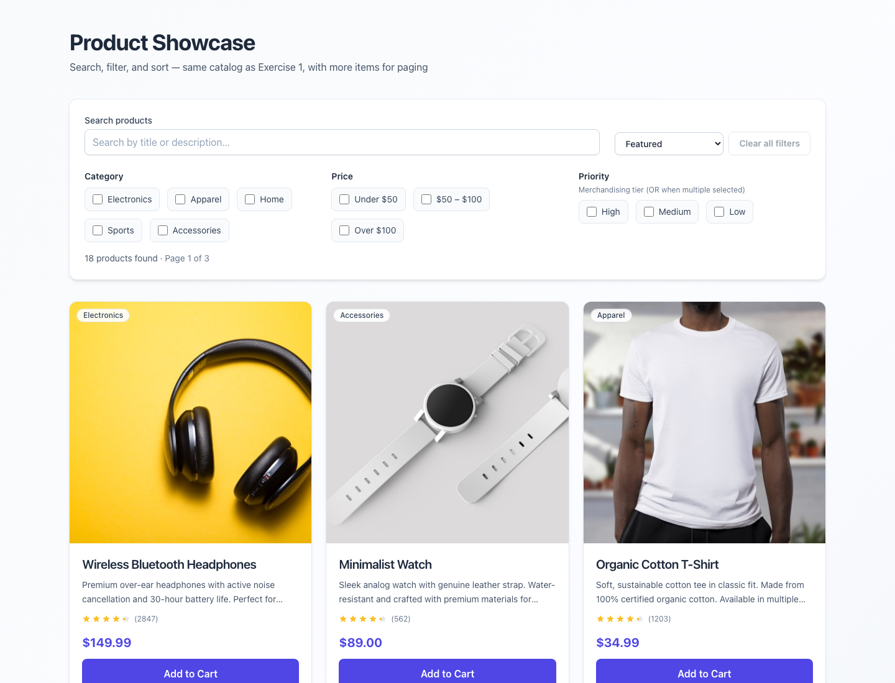

# Exercise 5 — Product search and Playwright E2E

A Create React App project with a **product search / catalog** UI and a **Playwright** end-to-end suite. The catalog supports **search**, **multi-select filters** (category, **price bracket**, priority), **sort** options, and **pagination**, with a clear **empty state** when no products match. The demo can show a **simulated load error** via a query flag for resilience testing.

## Purpose

### Application (`ProductCatalog`)

- **Search** — Text filter over titles/descriptions (debounced-style UX via React state).
- **Filters** — **Category** checkboxes, **price range** brackets (under $50, $50–$100, over $100), and priority toggles.
- **Sort** — Featured, price ascending/descending, rating, name.
- **Pagination** — Configurable page size (default 6), previous/next and status text.
- **Empty state** — Message when the filtered set is empty (`data-testid="product-catalog-empty"`).
- **Styling** — Tailwind CSS for a clean catalog + card grid (reuses `ProductCard` / `RatingStars`).

`ProductSearchDemo` wraps the catalog. Append **`?catalogError=1`** to the URL to render an **error screen** with retry (`data-testid="catalog-error"`, etc.) for manual checks or future E2E.

### Playwright E2E

Specs exercise **search**, **category / price / combined filters**, **sorting**, **pagination**, **empty results**, and **responsive behavior** across **desktop, tablet, and mobile** projects. Tests use a **page object** (`e2e/pages/ProductCatalogPage.ts`) and stable `data-testid` hooks.

**Empty results** are covered (e.g. no-match search, impossible filter combos, viewports). **Error UI** is implemented in the app; extend Playwright with a scenario that opens `/?catalogError=1` if you want automated coverage for that path.

## Requirements

- **Node.js** 18+ and **npm**.

## Setup

1. From this directory (the Create React App root):

   ```bash
   npm install --legacy-peer-deps
   ```

   Use `--legacy-peer-deps` if `npm install` complains about `react-scripts` and TypeScript 5 peers.

2. **Run the app** (default port **3000**):

   ```bash
   npm start
   ```

   Open [http://localhost:3000](http://localhost:3000).

3. Optional:

   ```bash
   BROWSER=none npm start
   ```

4. **Playwright browsers** (first time):

   ```bash
   npm run test:e2e:install
   ```

5. **E2E tests** — `playwright.config.ts` starts the dev server on **port 3010** and sets `baseURL` accordingly (or reuses an existing server when not in CI):

   ```bash
   npm run test:e2e
   npm run test:e2e:headed
   npm run test:e2e:report
   ```

   Run a single browser project, e.g.:

   ```bash
   npx playwright test --project desktop-chrome
   ```

### Troubleshooting

- **`EMFILE`** / watcher limits — Raise `ulimit -n` before `npm start`, or see [CRA troubleshooting](https://facebook.github.io/create-react-app/docs/troubleshooting).
- **Port clash** — If 3010 is taken when Playwright starts its `webServer`, free the port or adjust `playwright.config.ts`.

## Project structure

```text
.                             ← Create React App root (this folder)
├── docs/
│   └── demo-screenshot.png   ← product catalog demo
├── e2e/
│   ├── pages/
│   │   └── ProductCatalogPage.ts   # Page Object Model
│   ├── tests/
│   │   ├── search.spec.ts
│   │   ├── filters.spec.ts
│   │   ├── sorting.spec.ts
│   │   ├── pagination.spec.ts
│   │   └── viewport.spec.ts
│   └── TEST-REPORT.md
├── public/
├── src/
│   ├── components/
│   │   ├── ProductCard.tsx
│   │   └── RatingStars.tsx
│   ├── exercise5/
│   │   ├── ProductCatalog.tsx      # Main catalog UI + filters
│   │   ├── ProductCatalog.test.tsx  # RTL unit tests
│   │   ├── filterUtils.ts
│   │   ├── mockProducts.ts
│   │   └── index.ts
│   ├── pages/
│   │   └── ProductSearchDemo.tsx   # Catalog + optional ?catalogError=1
│   ├── types/
│   │   └── product.ts
│   ├── App.js
│   ├── index.js
│   └── index.css
├── playwright.config.ts
├── package.json
├── tailwind.config.js
├── postcss.config.js
└── tsconfig.json
```

One level up, the **exercise 5** folder has a short README that links here.

## Demo screenshot

Product catalog at `http://localhost:3000`:



---

This project was bootstrapped with [Create React App](https://github.com/facebook/create-react-app). More CRA topics: [CRA documentation](https://facebook.github.io/create-react-app/docs/getting-started).
