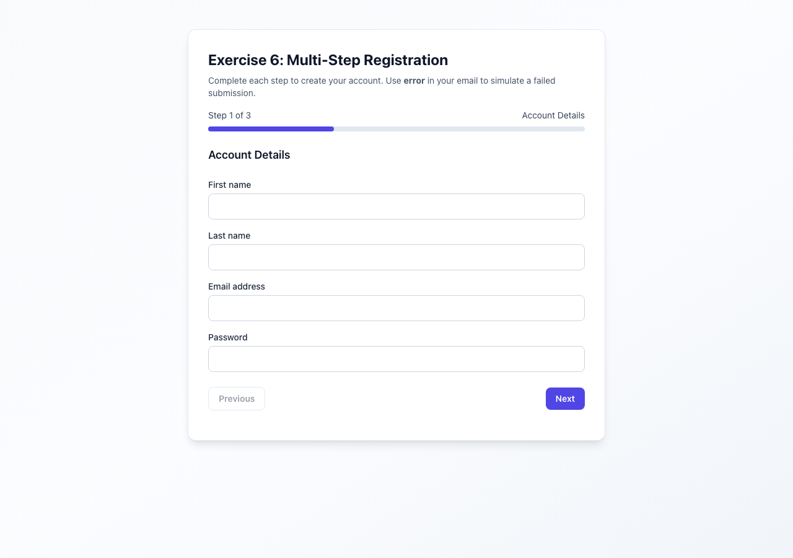

# Exercise 6 — Multi-step registration and Playwright E2E

A Create React App project with a **three-step registration wizard** (`MultiStepRegistrationForm`) and **Playwright** tests that cover **validation**, **step navigation**, **submit success and failure**, and **accessibility** expectations (labels, `role="alert"` errors, live status region, progress bar).

## Purpose

### Application

- **Steps** — (1) Account Details — name, email, password; (2) Profile Information — username, phone; (3) Additional Details — country, optional bio.
- **Validation** — Per-step rules (required fields, email format, length limits, username pattern, phone pattern, bio length); invalid fields get **`aria-invalid`** and inline hints; a summary **`role="alert"`** lists problems when advancing with errors.
- **Navigation** — **Next** / **Previous** preserves field values; progress indicator exposes **`role="progressbar"`** with `aria-valuenow` reflecting completion.
- **Submission** — Simulated async submit with **success** and **error** paths; status text lives in **`#form-status`** with **`role="status"`** and **`aria-live="polite"`** so screen readers hear updates. Using **`qa-error@example.com`** on step 1 triggers the **failure** message after submit (for tests).

`RegistrationDemo` wraps the form in a simple page shell.

### Playwright (`e2e/tests/registration.spec.ts`)

- **Field validation** — Required errors, then format/length errors; asserts alert copy and `aria-invalid` on inputs.
- **Navigation** — Next/previous across steps while checking legends, step copy (e.g. “Step 2 of 3”), and preserved values.
- **Submission** — Happy path through step 3 → success copy; **error path** with `qa-error@example.com` → failure copy.
- **Accessibility checks** — Visible labels via **`getByLabel`**, `role="alert"` on the error summary, `role="status"` / **`aria-live="polite"`** on status, `aria-describedby` on the form, and progress bar **`aria-valuenow`** at 100% on the last step.

The **page object** `e2e/pages/RegistrationPage.ts` centralizes selectors and helpers (`fillStepOne`, `goToStepThree`, etc.).

## Requirements

- **Node.js** 18+ and **npm**.

## Setup

1. From this directory (the Create React App root):

   ```bash
   npm install --legacy-peer-deps
   ```

   Use `--legacy-peer-deps` if `react-scripts` + TypeScript 5 peer resolution fails.

2. **Run the demo** (default port **3000**):

   ```bash
   npm start
   ```

   Open [http://localhost:3000](http://localhost:3000).

3. Optional:

   ```bash
   BROWSER=none npm start
   ```

4. **Playwright browsers** (first time):

   ```bash
   npx playwright install
   ```

5. **E2E tests** — `playwright.config.ts` sets **`baseURL` to `http://localhost:3010`** (so the app does not collide with another exercise on 3000). Start the app on **3010** in a second terminal, then run tests:

   ```bash
   PORT=3010 BROWSER=none npm start
   ```

   ```bash
   npm run test:e2e
   npm run test:e2e:headed
   npm run test:e2e:report
   ```

   Target one project, e.g.:

   ```bash
   npx playwright test --project desktop-chrome
   ```

### Troubleshooting

- **`EMFILE`** — Raise `ulimit -n` before `npm start`, or see [CRA troubleshooting](https://facebook.github.io/create-react-app/docs/troubleshooting).
- **Playwright can’t reach app** — Confirm something is listening on **3010** when running E2E, or temporarily change `baseURL` in `playwright.config.ts`.

## Project structure

```text
.                             ← Create React App root (this folder)
├── docs/
│   └── demo-screenshot.png   ← registration wizard (step 1)
├── e2e/
│   ├── pages/
│   │   └── RegistrationPage.ts   # Page Object Model
│   ├── tests/
│   │   └── registration.spec.ts
│   └── TEST-REPORT.md
├── public/
├── src/
│   ├── exercise6/
│   │   ├── MultiStepRegistrationForm.tsx
│   │   └── index.ts
│   ├── pages/
│   │   └── RegistrationDemo.tsx
│   ├── App.js
│   ├── index.js
│   └── index.css
├── playwright.config.ts
├── package.json
├── tailwind.config.js
├── postcss.config.js
└── tsconfig.json
```

One level up, the **exercise 6** folder has a short README that links here.

## Demo screenshot

Registration flow at `http://localhost:3000`:



---

This project was bootstrapped with [Create React App](https://github.com/facebook/create-react-app). More CRA topics: [CRA documentation](https://facebook.github.io/create-react-app/docs/getting-started).
