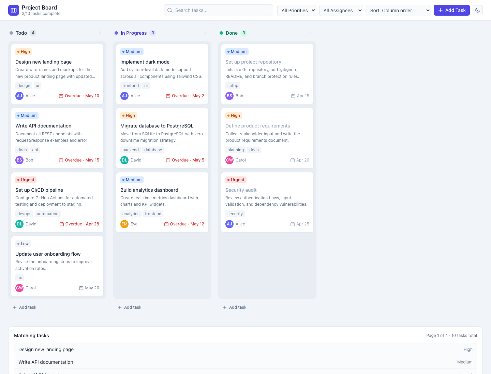

# Exercise 7 — Kanban board

A Create React App + **TypeScript** project with a **Kanban board**: columns **Todo**, **In Progress**, and **Done**; **task cards** showing **assignees** (avatar + name), **due dates** (with overdue styling when applicable), **priority** labels (low → urgent), optional description and tags; **drag-and-drop** to move cards between columns using [**@hello-pangea/dnd**](https://github.com/hello-pangea/dnd). Styling is **Tailwind CSS** with **`darkMode: 'class'`** and a header **dark mode** toggle (initial theme follows `prefers-color-scheme`).

The board also includes search, priority/assignee filters, a paginated “matching tasks” directory (sortable, read-only), **Add / Edit task** modal, and an optional **`?e2eError=1`** load-error state for tests.

## Purpose

- **`KanbanBoard`** — State for columns and tasks; `DragDropContext` + column droppables + card draggables; progress summary (e.g. tasks complete).
- **`BoardColumn` / `TaskCard`** — Column chrome and draggable cards with priority styling and actions (edit/delete).
- **`AddTaskModal`** — Create or update tasks (assignee, due date, priority, column, tags).
- **`types.ts`** — `Task`, `Column`, `Assignee`, priorities, and seed `INITIAL_COLUMNS`.

### Playwright E2E

Specs under **`e2e/`** cover board interactions, filters, search, modal, viewports, pagination/sort/error flows. **`playwright.config.ts`** builds the app and serves the **`build/`** folder on **port 3027** via a short `python3 -m http.server` command so tests run against a static bundle.

## Requirements

- **Node.js** 18+ and **npm**.
- **Python 3** on your PATH (used only when running **`npm run test:e2e`**, for the static file server).

## Setup

1. From this directory (the Create React App root):

   ```bash
   npm install --legacy-peer-deps
   ```

   Use `--legacy-peer-deps` if `react-scripts` + TypeScript 5 peer resolution fails.

2. **Development server** (port **3000**):

   ```bash
   npm start
   ```

   Open [http://localhost:3000](http://localhost:3000).

3. Optional:

   ```bash
   BROWSER=none npm start
   ```

4. **Playwright** (first time):

   ```bash
   npm run test:e2e:install
   ```

5. **E2E** (build + static server on **3027**, configured in `playwright.config.ts`):

   ```bash
   npm run test:e2e
   npm run test:e2e:headed
   npm run test:e2e:report
   ```

### Troubleshooting

- **`EMFILE`** — Raise `ulimit -n` before `npm start`, or see [CRA troubleshooting](https://facebook.github.io/create-react-app/docs/troubleshooting).
- **E2E fails to start server** — Ensure `python3` is available; or adjust `webServer.command` in `playwright.config.ts` to another static server.

## Project structure

```text
.                             ← Create React App root (this folder)
├── docs/
│   └── demo-screenshot.png   ← Kanban board (light theme)
├── e2e/
│   ├── pages/
│   │   └── KanbanBoardPage.ts
│   ├── tests/
│   │   ├── board.spec.ts
│   │   ├── filters.spec.ts
│   │   ├── search.spec.ts
│   │   ├── modal.spec.ts
│   │   ├── viewport.spec.ts
│   │   └── pagination-sort-error.spec.ts
│   └── TEST-REPORT.md
├── public/
├── src/
│   ├── exercise7/
│   │   ├── KanbanBoard.tsx
│   │   ├── BoardColumn.tsx
│   │   ├── TaskCard.tsx
│   │   ├── AddTaskModal.tsx
│   │   ├── types.ts
│   │   └── index.ts
│   ├── App.tsx
│   ├── index.tsx
│   └── index.css
├── playwright.config.ts
├── package.json
├── tailwind.config.js          # darkMode: 'class'
├── postcss.config.js
└── tsconfig.json
```

One level up, the **exercise 7** folder has a short README that links here.

## Demo screenshot

Kanban board at `http://localhost:3000`:



Use the **dark mode** control in the header to switch themes.

---

This project was bootstrapped with [Create React App](https://github.com/facebook/create-react-app). More CRA topics: [CRA documentation](https://facebook.github.io/create-react-app/docs/getting-started).
