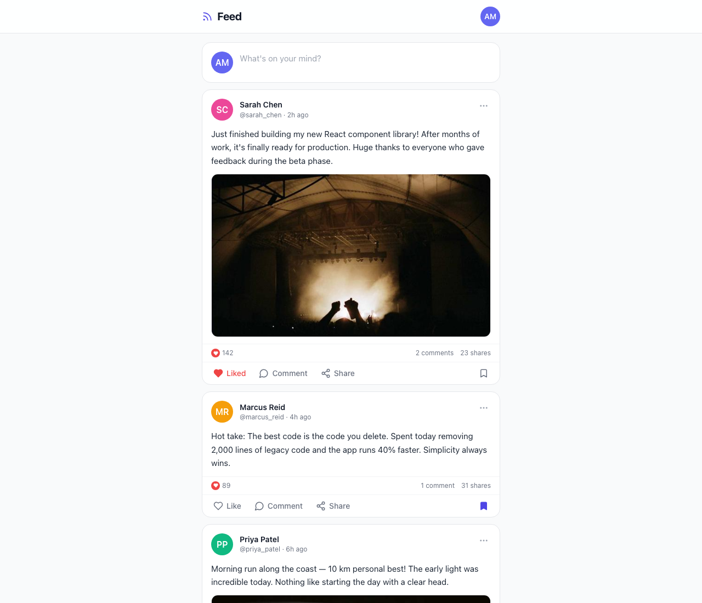

# Exercise 8 — Social media feed

A Create React App + **TypeScript** demo of a **social feed**: **post cards** with **user avatar and identity**, **text content**, optional **images**, **Like / comment / share / bookmark** actions, expandable **comment threads** (list, likes on comments, “show more”, add comment); a **composer** at the top (**Create post**: text, optional random image from Picsum, keyboard submit); and **infinite scroll** that loads more mock posts via an **Intersection Observer** sentinel (simulated network delay, ends with “You’re all caught up!”). Layout and polish use **Tailwind CSS**, **rounded cards**, and **lucide-react** icons for a **modern** look.

## Purpose

- **`Feed`** — Shell with sticky header, wires mock users/posts, handlers for create/like/comment/share/bookmark, and infinite scroll pages (`MAX_PAGES` limit).
- **`PostCard`** — Article layout: author block, body, media, stats row, action bar (Heart, MessageCircle, Share2, Bookmark), toggles **CommentSection**.
- **`CommentSection`** — Renders threaded-style comments with avatars, like buttons, inline composer (Enter to send).
- **`CreatePost`** — Expandable textarea, optional image attachment UI, submit / cancel patterns.
- **`UserAvatar` / `types.ts`** — Shared user/post/comment types and avatar initials.

## Requirements

- **Node.js** 18+ and **npm**.

## Setup

1. From this directory (the Create React App root):

   ```bash
   npm install --legacy-peer-deps
   ```

   Use `--legacy-peer-deps` if `react-scripts` + TypeScript 5 peer resolution fails.

2. **Development server** (port **3000**):

   ```bash
   npm start
   ```

   Open [http://localhost:3000](http://localhost:3000).

3. Optional:

   ```bash
   BROWSER=none npm start
   ```

4. **Unit tests** (if you add or extend them):

   ```bash
   npm test
   ```

### Troubleshooting

- **`EMFILE`** — Raise `ulimit -n` before `npm start`, or see [CRA troubleshooting](https://facebook.github.io/create-react-app/docs/troubleshooting).

## Project structure

```text
.                             ← Create React App root (this folder)
├── docs/
│   └── demo-screenshot.png   ← Feed with composer and post cards
├── public/
├── src/
│   ├── exercise8/
│   │   ├── Feed.tsx            # Feed page, scroll, state
│   │   ├── PostCard.tsx        # Post card + actions
│   │   ├── CommentSection.tsx  # Comments + composer
│   │   ├── CreatePost.tsx      # New post form
│   │   ├── UserAvatar.tsx
│   │   └── types.ts
│   ├── App.tsx
│   ├── index.tsx
│   └── index.css               # Tailwind directives
├── package.json
├── tailwind.config.js
├── postcss.config.js
└── tsconfig.json
```

One level up, the **exercise 8** folder has a short README that links here.

## Demo screenshot

Social feed at `http://localhost:3000`:



---

This project was bootstrapped with [Create React App](https://github.com/facebook/create-react-app). More CRA topics: [CRA documentation](https://facebook.github.io/create-react-app/docs/getting-started).
