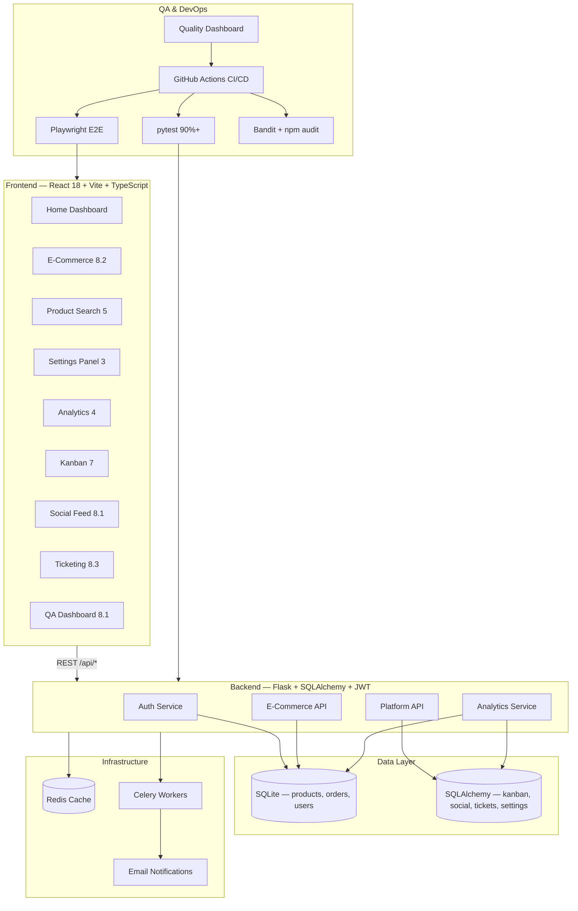

# CursorHub Platform — Architecture & Application Design

## Overview

**CursorHub** is a unified full-stack platform that integrates eight course exercises into a single deployable application with shared authentication, navigation, QA automation, and CI/CD.

## Architecture Diagram



## Module Mapping

| Requirement | Source Exercise | Route | Backend |
|-------------|-----------------|-------|---------|
| E-commerce | 8.2 | `/shop`, `/cart`, `/checkout` | `/api/products`, `/api/checkout`, `/api/orders` |
| Settings panel | 3 | `/settings` | `/api/settings` |
| Product search | 5 | `/search` | `/api/products?search=&category=&sort=` |
| Analytics dashboard | 4 | `/analytics` | `/api/analytics/dashboard` |
| Kanban board | 7 | `/kanban` | `/api/kanban/tasks` |
| Social feed | 8.1 | `/social` | `/api/social/posts` |
| Ticketing system | 8.3 (7.3 PRD) | `/tickets` | `/api/tickets` |
| QA metrics dashboard | 8.1 QA | `/qa-dashboard` | `qa-automation/results/dashboard.html` |

## Technology Stack

### Frontend
- React 18, TypeScript, Vite, Tailwind CSS
- React Router v6 for SPA navigation
- `@hello-pangea/dnd` for Kanban drag-and-drop
- Playwright for E2E testing

### Backend
- Flask 3 application factory pattern
- SQLAlchemy ORM for platform models (kanban, social, tickets, settings)
- Raw SQLite for e-commerce (reused from 8.2)
- PyJWT authentication with role-based access control
- Flask-Caching with Redis (SimpleCache fallback)
- Celery background tasks for order notifications

### QA & DevOps
- pytest with 90%+ coverage target
- Playwright E2E suite
- Bandit security scanning
- GitHub Actions CI/CD pipeline
- HTML quality metrics dashboard

## API Design

All endpoints are prefixed with `/api`. Authentication uses `Authorization: Bearer <JWT>`.

| Method | Endpoint | Auth | Description |
|--------|----------|------|-------------|
| POST | `/auth/login` | No | Obtain JWT token |
| GET | `/products` | No | Search/filter/paginate products |
| POST | `/checkout` | Optional | Process order |
| GET | `/analytics/dashboard` | No | KPIs and transactions |
| GET/POST | `/kanban/tasks` | No | Kanban CRUD |
| GET/POST | `/social/posts` | No | Social feed |
| GET/POST | `/tickets` | Mixed | Create public, list authenticated |
| GET/PUT | `/settings` | Yes | User preferences |

## Deployment Architecture

```
GitHub Push → CI/CD Pipeline → Tests + Security → Docker Build → Deploy
                     ↓
              Coverage Report + QA Dashboard
```

- **Backend**: Port 5060 (Flask)
- **Frontend**: Port 5180 (Vite dev) / static build for production
- **Redis**: Port 6379 (caching + Celery broker)
- **Celery Worker**: Background email/notification tasks
